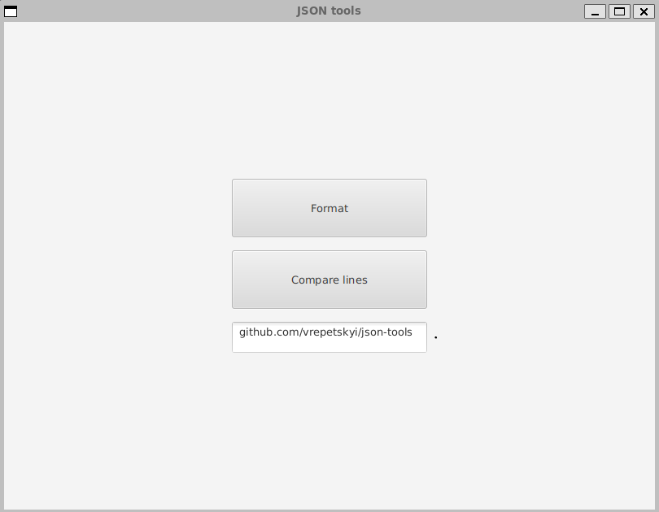
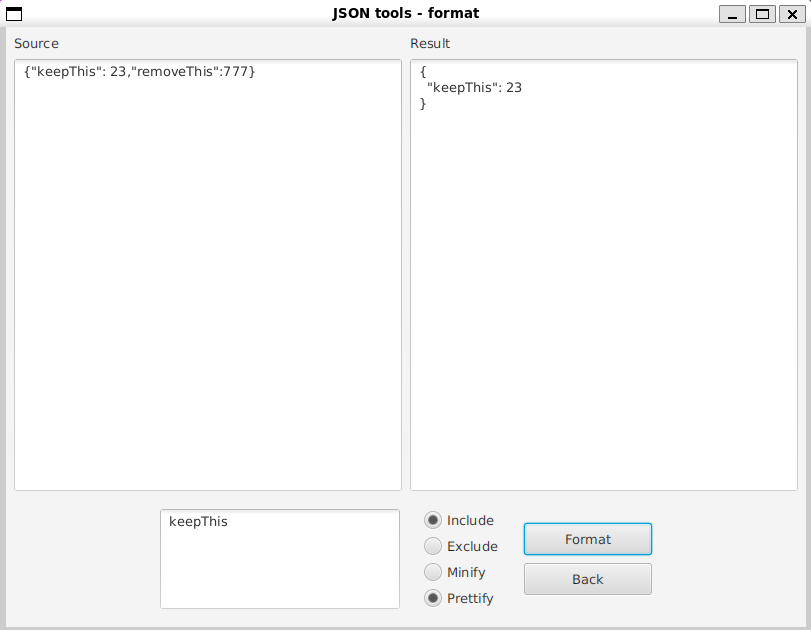

# JSON tools

Software Engineering final team project implementing _REST API_ and _JavaFX GUI_ interfaces for operating strings and JSON.

> Application for programmers who need to reformat or filter data structures saved in JSON format and to compare the structures with each other. JSON tools application allows you to both minify the unminified JSON representation, as well as the reverse operation (with any blanks and new lines added). The application will be available via GUI, as well as as a remote API, so it can be integrated with existing tools.

## Links

- [**_Javadoc and UML_**](https://vrepetskyi.github.io/json-tools/)
- [**_The latest JAR_**](https://vrepetskyi.github.io/json-tools/json-tools.zip)
- [**_All releases and JARs_**](https://github.com/vrepetskyi/json-tools/releases)
- [**_Development roadmap_**](https://github.com/users/vrepetskyi/projects/1/)

## Architecture

The project is divided into _core_, _api_, and _gui_ packages.

The _core_ implements the main functionality in an interface-agnostic way, while the other packages depend on it. At the same time, formatting is built on top of a _Decorator_ design pattern, and the _Gson_ library is a primary way of interacting with JSON.

The _api_ creates a _vanilla HTTP server_ and registers the required endpoints. The _request parsing_ and _response sending_ functionality are _extracted_ and _reused_, while the only _endpoint-specific_ code is a _resolver_.

The _gui_ contains _controllers_ for the _menu_, _formatting_, and _comparison_ views. The _layout_ is defined using _FXML_ and is _responsive_.

The _main application class_ is _JsonTools_. It _starts separate threads for API and GUI_.

## Execution

<table>
    <tr>
        <td colspan="2">Compiled</td>
    </tr>
    <tr>
        <td><code>java -jar json-tools*.jar</code></td>
        <td>* stands for version</td>
    </tr>
    <tr>
        <td colspan="2">Source</td>
    </tr>
    <tr>
        <td><code>mvn install</code></td>
        <td>install <em>dependencies</em></td>
    </tr>
    <tr>
        <td><code>mvn javafx:run</code></td>
        <td><em>run</em> from source</td>
    </tr>
    <tr>
        <td><code>mvn package</code></td>
        <td>create a <em>jar</em> at target directory</td>
    </tr>
    <tr>
        <td><code>mvn verify</code></td>
        <td>prepare everything for <em>deploy</em></td>
    </tr>
    <tr>
        <td><code>mvn clean</code></td>
        <td>in case something went wrong</td>
    </tr>
</table>

## API

<table>
    <tr>
        <td>Port</td>
        <td>8080</td>
    </tr>
    <tr>
        <td>Request method</td>
        <td>POST</td>
    </tr>
    <tr>
        <td>Response codes</td>
        <td>200, 400, 405, 500</td>
    </tr>
</table>

For non-200 response codes, all the endpoints return an error message.

### /api/format-json

Request format:

```
{
    "source",           // * A JSON object to be formatted
    "arguments": {      // * Formatting arguments
        "filter": {     //   Filtering arguments; ommited if incomplete
            "keys",     //   A string array of keys to filter; no nesting
            "exclude"   //   A flag to include/exclude the specified keys
        "prettify"      //   A flag for prettification/minification of the result
    }
}
```

Successfull response: the resulting JSON.

### /api/compare-strings

Request format:

```
{
  "s1",                 // * The first string to be compared
  "s2",                 // * The second string to be compared
  "arguments": {        // * Comparison arguments
    "mode"              // * Categorical; either "different" or "identical"
  }
}
```

Successfull response: the line numbers as a JSON array.

## GUI




